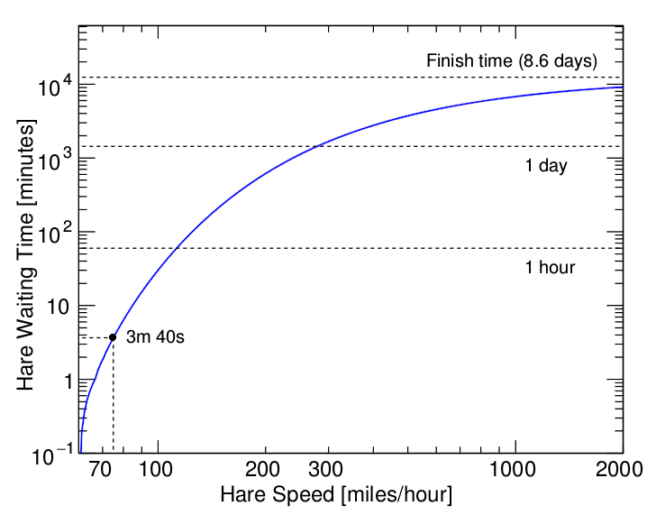
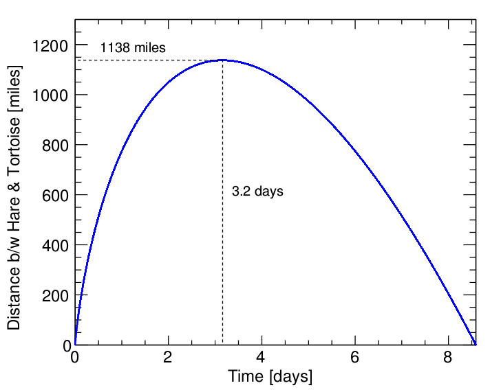

# tortoise_hare

At 75 mph, the hare needs to wait 3m 40s before starting in order to finish at the same time as the tortoise. They will both cross the finish line in 8d 14h 6m 28.09s!

Here's how the waiting time depends on the speed of the hare:

And in the 75 mph solution, the magical stretching makes the tortoise distance to the hare increase for 3.2 days until finally the hare starts to catch up. At the peak, the distance between them reaches 1138 miles!

